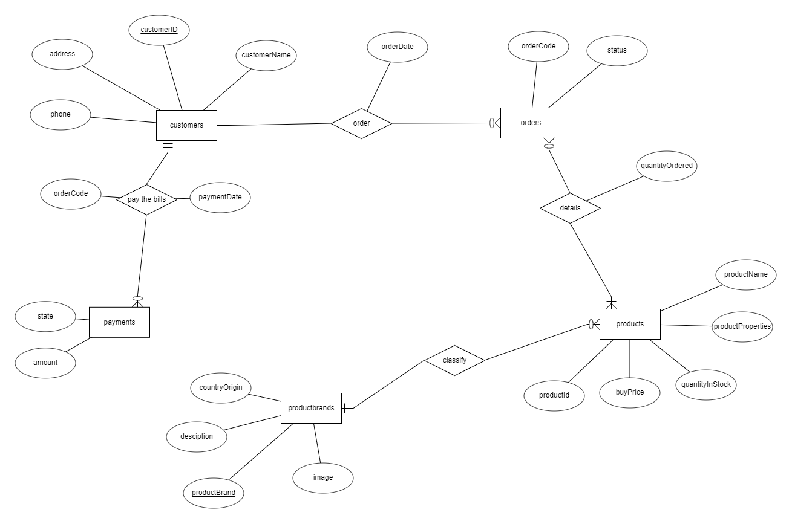
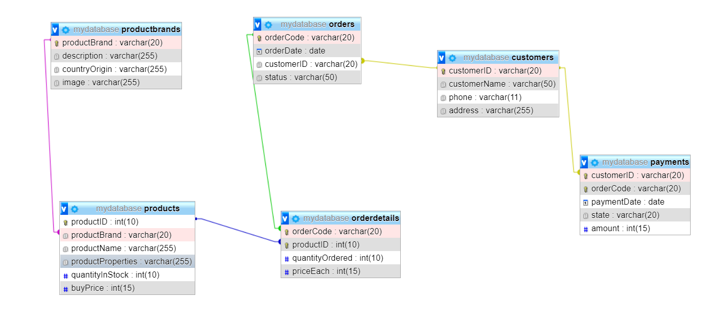

# BÁO CÁO BÀI TẬP LỚN CƠ SỞ DỮ LIỆU
## Chủ đề: Website bán laptop online
  * Môn học: Cơ sở dữ liệu
  * Mã lớp: INT2207 1
  * Giáo viên: TS.Lê Hồng Hải
## Các thành viên tham gia trong nhóm
  * Nguyễn Thành Đạt
  * Tạ Quang Ngọc
  * Nguyễn Đăng Nam
### I. Khái quát về dự án
#### 1. Ý tưởng về trang web
- Vì tình hình dịnh bệnh Covid-19 đang hoành hành, mọi người dân đều được khuyến khích không ra ngoài nếu không cần thiết. Nhiều của hàng phải đóng của và chịu lỗ vì không có người đến mua.
- Dựa trên tình hình đó, bọn em quyết định làm 1 website bán hàng online cho những hộ kinh doanh nhỏ lẻ với các tính năng cốt lõi cần thiết.
#### 2. Các chức năng của trang web
Trang web có các tính năng thiết yếu, dễ sử dụng cho người dùng.
|Chức năng|Mô tả|
|-----------|---------|
|Hiển thị sản phẩm bán chạy|Các sản phẩm bán chạy nhất được hiện ngay đầu giúp người dùng dễ lựa chọn|
|Hiển thị sản phẩm theo thương hiệu|Án vào thương hiệu máy tính `Mac`, `Asus`,... đề hiện sản phẩm theo thương hiệu|
|Tìm kiếm|Gõ tên sản phẩm muốn vào thanh tìm kiếm để tìm sản phẩm|
|Thêm bớt sản phẩm|Người dùng có thể thêm, bớt, xóa sản phẩm trong giỏ hàng tùy thích|
|Đặt hàng|Nhập họ và tên, số điện thoại và địa chỉ sau khi chọn sản phẩm để đặt hàng|
#### 3. Chức năng của cơ sở dữ liệu
a. Ứng dụng của cơ sở dữ liệu
- Quản lí sản phẩm
- Quản lí đơn hàng
- Quản lí giao dịch
b. Các dữ liệu cần lưu trữ
- Dữ liệu về người đặt hàng
- Dữ liệu về sản phẩm
- Dữ liệu về đơn hàng
- Dữ liệu về giao dịch thanh toán
### II. Thiết kế cơ sở dữ liệu
#### Thiết kế mô hình thực thể ER

#### Mô hình cơ sở dữ liệu (được tạo bằng MySQL)

### III. Các câu lệnh truy vấn MySQL
Đây là các câu lệnh dùng để lấy, thêm dữ liệu vào cơ sở dữ liệu thông qua thao tác của người dùng
* Kết nối database
~~~ 
var mysql = require('mysql');  
const connection = mysql.createConnection({
	host: process.env.HOST,
	user: process.env.USER,
	password: process.env.PW,
	database: process.env.DB,
});
connection.connect((err)=>{
	if (err) throw err;
	console.log('Connecting MySql...' );
})
~~~
* Đưa ra các sản phẩm trong database
  * Lấy ra các sản phẩm bán chạy rồi đưa ra trang chủ.
  ~~~
  let sql = 'SELECT productId, `productName`, `productBrand`, `productScreen`, `productCPU`, `productRAM`, `productVGA`, `productOS`,     `productWeight`, `productImage`, FORMAT(`buyPrice`,0) buyPrice FROM `products` ORDER BY `quantityBought` DESC LIMIT 4'
	connection.query(sql, function(error, result, field) {
		res.render('index', {
			bestSellerProduct: result,
			title: "Trang chủ"
		})
	})
  ~~~
  * Lấy ra sản phẩm của các hãng đưa ra màn hình (ví dụ: Asus)
  ~~~
  var productBrand = 'Asus';
	let sql = 'SELECT productId,`productName`, `productBrand`, `productScreen`, `productCPU`, `productRAM`, `productVGA`, `productOS`,       `productWeight`, `productImage`, FORMAT(`buyPrice`,0) buyPrice FROM `products` WHERE productBrand =? '
	connection.query(sql, [productBrand],function(error, result, field) {
		res.render('product/asus', {
			products: result,
			title: productBrand
		})
	})
  ~~~
* Tìm kiếm
  * Xác định sản phẩm người dùng tìm kiếm
  ~~~
  var q = "'%"+req.query.txtSearch +"%'";
  ~~~
  * Tìm kiếm những sản phẩm mà tên có những kí tự trên
  ~~~
  let sql = 'SELECT productId,`productName`, `productBrand`, `productScreen`, `productCPU`, `productRAM`, `productVGA`, `productOS`, `productWeight`, `productImage`, FORMAT(`buyPrice`,0) buyPrice FROM `products` WHERE productName LIKE '+ q;
	connection.query(sql, function(error, result, field) {
		res.render('search', {
			searchProduct: result
		})
	})
  ~~~
* Tạo ID cho người dùng khi truy cập trang web (sử dụng cookies)  
  * Khi người dùng chưa có cookies, sẽ tạo ID và lưu vào database
  ~~~
  if (!req.signedCookies.sessionId) {
		var sessionId = shortId.generate();
		res.cookie('sessionId', sessionId,{signed: true})
		var cusId = {customerId: sessionId};
		let sql = 'INSERT INTO customers SET ?';
		connection.query(sql, cusId , function(error, result, field) {
		if (error) throw error;
	})
	}
  ~~~
  * Khi người dùng đã có cookies:  
  Kiểm tra xem đã có ID trong database chưa. Nếu chưa có thì thêm ID vào database
  ~~~
  let sql = 'SELECT customerId FROM customers WHERE customerId = ?';
  connection.query(sql,[req.signedCookies.sessionId],function(error,result,field) {
	if (result.length == 0) {
		let sql_id = 'INSERT INTO customers SET customerId = ?';
		connection.query(sql_id,[req.signedCookies.sessionId], function(error,result,field) {
			if (error) throw error;
		})
	}
  })
  ~~~
* Khi khách hàng đặt hàng
  * Lấy thông tin về khách hàng
  ~~~
  var id = req.signedCookies.sessionId;
	var name = req.body.txtName;
	var phone= req.body.txtPhone;
	var address = req.body.txtAddress;
  ~~~
  * Thêm thông tin khách hàng vào database
  ~~~
  let sql = 'UPDATE customers SET customerName =?, phone =?, address =? WHERE customerID =?';
	connection.query(sql, [name, phone, address, id], function(error, result, field) {
			if (error) throw error;
	 })
  ~~~
  * Thêm thông tin cơ bản của đơn hàng (ngày đặt, người đặt,...) vào database
  ~~~
  var orderCode = shortid.generate();
  let sql_2 = 'INSERT INTO orders SET status = "ordered", customerID = ?, orderCode = ?, orderDate = NOW()';
	connection.query(sql_2, [id, orderCode], function(error, result, field) {
		if (error) throw error;
	})
  ~~~
  * Thêm đơn thanh toán (trạng thái chưa thanh toán)
  ~~~
  let sql_payment = "INSERT INTO payments SET customerID = ?, orderCOde =?, state = 'pending'";
	connection.query(sql_payment, [id, orderCode], function(error, result, field) {
		if (error) throw error;
	})
  ~~~
  * Thêm chi tiết thông tin đơn hàng (sản phẩm, số lượng,...) từ session
  ~~~
  var query = '';
	for (var t of req.session.cart) {
		query += "('"+ orderCode + "',"+ t.productId+','+ t.quantity+",'"+ t.buyPrice+"')," 
	}
  let sql_details = 'INSERT INTO `orderdetails`(`orderCode`, `productId`, `quantityOrdered`, `priceEach`) VALUES '+ query;
	sql_details = sql_details.substring(0,sql_details.length-1);
	connection.query(sql_details, function(error,result,field) {
		if (error) throw error;
	})
  ~~~
  
